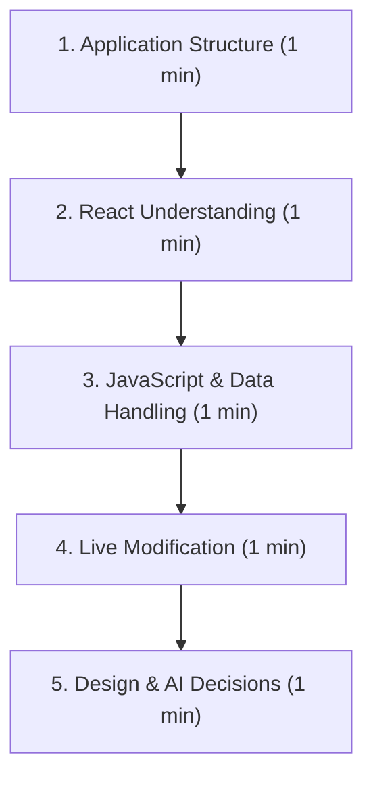

# 🎓 FLEX 2.0 — Viva Defense & Live Modification Cheatsheet
### Software for Mobile Devices (Assignment 1) — 20 Marks Allocated for Viva!

> Keep this file open or review it right before your viva. It is designed to help you score the full **20 marks** on application structure, React understanding, JavaScript data handling, live modification, and design defense.

---

## ⏱️ The 5-Minute Viva Breakdown



---

## 1. Application Structure (1 Minute Pitch)
**Examiner Question**: *"Explain the main components and how the application is organized."*

**Your Answer**:
> *"Sir/Madam, I structured the application using a layered clean architecture with strict adherence to class constraints:*
> 1. ***Data Layer (`src/data/`)***: *Contains structured mock datasets (`mockStudent.js`, `mockCourses.js`) modeling student profile, attendance logs, and course evaluation weightages.*
> 2. ***Pure JS Utilities (`src/utils/`)***: *Separates all business logic into deterministic functions—`attendanceCalculators.js` for safe bunks and recovery formulas, `gpaCalculators.js` for target final exam predictions, and `formValidators.js` for regex checks.*
> 3. ***Global State (`src/state/AcademicContext.js`)***: *A React Context provider managing enrolled courses, view state, thresholds, and simulation actions.*
> 4. ***Atomic Components (`src/components/`)***: *Reusable cards (`AuraCard`), badges (`StatusBadge`), inputs (`AuraInput`), buttons (`AuraButton`), and three `react-native-chart-kit` chart wrappers.*
> 5. ***View Orchestration (`App.js`)***: *Pure React state-based view switching (`activeView`) using top Command Pills and breadcrumbs without any external navigation libraries or bottom/side bars."*

---

## 2. React Understanding (1 Minute Pitch)
**Examiner Question**: *"Where and why are State, Props, Events, or Conditional Rendering used?"*

| Concept | Where it is used in code | Why it was used |
| :--- | :--- | :--- |
| **State (`useState`)** | `App.js`, `AcademicContext.js`, `CourseStudioView.js` | Manages `activeView` (`'DASHBOARD'`, `'ATTENDANCE'`, etc.), dynamic `courses` array, search query, filter chip, and controlled form inputs. |
| **Derived State (`useMemo`)** | `AcademicContext.js` (`overallAttendance`, `currentSgpa`, `atRiskCourses`) | Efficiently recalculates overall metrics only when the underlying courses array changes. |
| **Props** | `AuraCard`, `StatusBadge`, `ProgressBar`, `GpaTrendChart` | Passes data (course codes, percentages, statuses, colors) and callbacks (`onPress`, `onAction`) into reusable UI elements. |
| **Events** | `AuraInput` (`onChangeText`, `onFocus`, `onBlur`), `Switch` (`onValueChange`), `TouchableOpacity` (`onPress`) | Captures user interactions like typing search terms, toggling elective status, and clicking simulation buttons. |
| **Conditional Rendering** | `App.js:L24-29`, `AttendanceForecasterView.js:L150`, `AlertNotice.js` | Switches between views (`{activeView === 'DASHBOARD' && <DashboardView />}`), renders `EmptyState` when search results are 0, and displays debarment warning banners. |

---

## 3. JavaScript & Data Handling (1 Minute Pitch)
**Examiner Question**: *"Show me where arrays, objects, filtering, mapping, or calculations are performed."*

**Key Code Anchors to Point Out**:
1. **Array `reduce()` for Cumulative Attendance**:
   - Location: `src/utils/attendanceCalculators.js:L81-98`
   - Purpose: Iterates through all enrolled courses to aggregate attended classes and total conducted classes to compute overall percentage.
2. **Array `filter()` for Course Status & Search**:
   - Location: `src/views/AttendanceForecasterView.js:L30-54`
   - Purpose: Chains fuzzy text search and semantic status filtering (`'SAFE'`, `'WARNING'`, `'CRITICAL'`).
3. **Array `map()` for UI Rendering & Chart Data**:
   - Location: `src/components/charts/GpaTrendChart.js:L20-25`
   - Purpose: Transforms array of semester GPA objects into parallel arrays of `labels` and `dataPoints` for `react-native-chart-kit`.
4. **Array `find()` for Letter Grade Conversion**:
   - Location: `src/utils/gpaCalculators.js:L46-52`
   - Purpose: Finds the first matching grade tier in `GRADE_SCALE`.
5. **The Bunk Math Formula**:
   - Location: `src/utils/attendanceCalculators.js:L45-56`
   - Formula: $\lfloor(100 \times \text{Attended} - T \times \text{Total}) / T\rfloor$ calculates exact safe bunks.

---

## 4. Live Modification Cheat Sheet (How to Pass in 10 Seconds)
During the viva, the instructor/TA may ask you to make a small live change. Here is exactly how to do each common request:

### Request A: *"Change the Attendance Threshold from 80% to 75% or 85%"*
- **File**: `src/constants/academicRules.js` (Line 15)
- **Change**:
  ```javascript
  // Change 80 to 75 or 85:
  ATTENDANCE_SAFE_THRESHOLD: 75,
  ```
- **Alternate In-App Demonstration**:
  Go to the **Bunk Forecaster** view and tap the built-in quick adapt buttons: `[75% Policy]`, `[80% Policy]`, or `[85% Policy]`. All badges and charts adjust live!

### Request B: *"Add a New Course to the Initial Dataset"*
- **File**: `src/data/mockCourses.js`
- **Change**: Copy one course block and paste it at the end of `INITIAL_COURSES`:
  ```javascript
  {
    id: 'c-6',
    code: 'CS-3015',
    title: 'Computer Networks',
    creditHours: 3,
    type: 'Core',
    instructor: 'Dr. Nadeem Kafi',
    room: 'Lab 1',
    schedule: 'Mon / Wed 01:00 - 02:30',
    attendance: { attended: 28, total: 30, recentHistory: [] },
    evaluations: [
      { id: 'ev-27', title: 'Midterm 1', weightage: 25, obtained: 22, total: 25 },
      { id: 'ev-28', title: 'Final Exam', weightage: 50, obtained: 0, total: 50, isPending: true }
    ],
  },
  ```

### Request C: *"Filter to show ONLY Critical or Low-Attendance Courses by default"*
- **File**: `src/state/AcademicContext.js` (Line 18)
- **Change**:
  ```javascript
  // Change 'ALL' to 'CRITICAL':
  const [attendanceFilter, setAttendanceFilter] = useState('CRITICAL');
  ```

### Request D: *"Change the Dean's Honor List GPA Cutoff"*
- **File**: `src/constants/academicRules.js` (Line 20)
- **Change**:
  ```javascript
  DEANS_LIST_GPA: 3.70, // Changed from 3.50
  ```

### Request E: *"Make the Course Code require 6 characters minimum in the form"*
- **File**: `src/utils/formValidators.js`
- **Change**:
  ```javascript
  if (trimmed.length < 6) {
    return { isValid: false, error: 'Course code must be at least 6 characters' };
  }
  ```

---

## 5. Design & AI Decisions (1 Minute Pitch)
**Examiner Question**: *"Defend one design decision and explain how AI contributed."*

**Your Answer**:
> *"A key design decision was to avoid standard table layouts used by traditional FLEX and replace them with an interactive **Bunk-o-Meter** and **Final Exam Target Solver**. In the real student experience, looking at 73.3% attendance creates anxiety, but knowing you specifically need to attend the next 2 classes transforms raw data into actionable behavior.*
>
> *AI was utilized as a pair programmer for architectural ideation, brainstorming the mathematical formulas for bunk margins and recovery classes, generating mock schemas, and refining form validation edge cases. Every component was tested and adapted to ensure strict compliance with class rules (zero navigation libraries, zero bottom/side bars) and full reactivity under React 19 and Expo SDK 57."*
